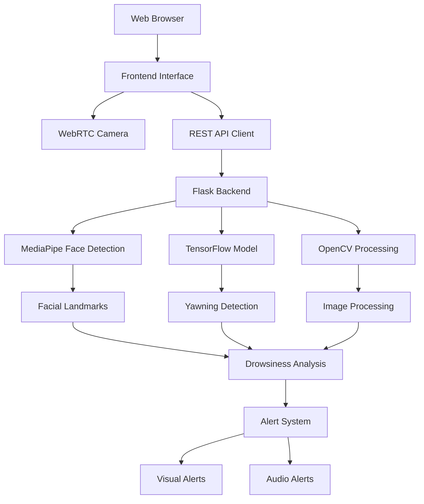

# 🚗 DriveSafe - Advanced Driver Drowsiness Detection System

<div align="center">


**A sophisticated real-time drowsiness detection system designed to enhance road safety through AI-powered monitoring.**


</div>

---

## 📋 Table of Contents

- [Overview](#overview)
- [Key Features](#key-features)
- [Technology Stack](#technology-stack)
- [System Architecture](#system-architecture)
- [Installation Guide](#installation-guide)
- [Usage Instructions](#usage-instructions)
- [API Documentation](#api-documentation)
- [Configuration](#configuration)
- [Troubleshooting](#troubleshooting)
- [Contributing](#contributing)
- [License](#license)

---

## 🎯 Overview

DriveSafe is an intelligent drowsiness detection system that leverages cutting-edge computer vision and machine learning technologies to monitor driver alertness in real-time. The system uses facial landmark detection and deep learning models to identify signs of drowsiness, including eye closure patterns and yawning behavior.

### 🎯 Target Applications

- **Commercial Fleet Management**: Monitor driver fatigue in logistics and transportation
- **Personal Safety**: Individual drivers seeking enhanced safety measures
- **Research & Development**: Academic studies on driver behavior and fatigue
- **Automotive Integration**: Potential integration with vehicle safety systems

---

## ✨ Key Features

### 🔍 **Advanced Detection Capabilities**
- **Real-time Eye Tracking**: Monitors eye aspect ratio (EAR) for precise drowsiness detection
- **Yawning Detection**: AI-powered mouth analysis using ResNet50V2 deep learning model
- **Facial Landmark Recognition**: 468-point MediaPipe face mesh for accurate feature detection
- **Adaptive Thresholding**: Dynamic calibration system for personalized detection sensitivity

### 🖥️ **Professional User Interface**
- **Modern Web Interface**: Responsive design with dark/light mode support
- **Real-time Monitoring Dashboard**: Live statistics and status indicators
- **Interactive Controls**: Adjustable sensitivity, threshold settings, and alert preferences
- **Comprehensive Statistics**: Detailed analytics including alert counts and monitoring duration

### 🔧 **Technical Excellence**
- **RESTful API Architecture**: Clean, well-documented API endpoints
- **Cross-Origin Resource Sharing (CORS)**: Seamless frontend-backend communication
- **Error Handling & Recovery**: Robust error management and connection recovery
- **Performance Optimization**: Efficient frame processing and resource management

### 🛡️ **Safety & Reliability**
- **Multi-level Alert System**: Visual and audio alerts with customizable sensitivity
- **Connection Monitoring**: Real-time backend connectivity status
- **Troubleshooting Tools**: Built-in diagnostic and reset capabilities
- **Data Privacy**: Local processing with no external data transmission

---

## 🛠️ Technology Stack

### **Backend Technologies**
- **Python 3.10.11**: Core programming language
- **Flask 3.0.0**: Lightweight web framework
- **TensorFlow 2.15.0**: Deep learning model inference
- **OpenCV 4.9.0.80**: Computer vision and image processing
- **MediaPipe 0.10.8**: Facial landmark detection
- **NumPy 1.24.3**: Numerical computing

### **Frontend Technologies**
- **HTML5**: Semantic markup structure
- **CSS3**: Modern styling with Tailwind CSS
- **JavaScript (ES6+)**: Interactive functionality
- **WebRTC**: Real-time camera access
- **Canvas API**: Image processing and capture

### **Development Tools**
- **Flask-CORS 4.0.0**: Cross-origin request handling
- **Gdown 4.7.1**: Model file management
- **python-dotenv**: Environment variable management

---

## 🏗️ System Architecture



---

## 🚀 Quick Start: Run Locally

### 1. **Clone the Repository**

```bash
git clone https://github.com/aadii-chavan/Driver-Drowsiness.git
cd Driver-Drowsiness
```

### 2. **Create a Virtual Environment**

```bash
python -m venv drowsiness_env
# On Windows:
drowsiness_env\Scripts\activate
# On macOS/Linux:
source drowsiness_env/bin/activate
```

### 3. **Install Dependencies**

```bash
pip install -r requirements.txt
```

### 4. **Download the Model**

The app will attempt to download the model automatically on first run. If it fails, you can manually download it:

- Run the helper script:
  ```bash
  python download_model.py
  ```
- Or manually download from [Google Drive](https://drive.google.com/uc?id=1UInMiIbaHChmI-KSQ7VRMp_53RZpSDd4), rename to `resnet50v2_model.keras`, and place it in the `model/` folder.

> **Note:** If the model is missing, the app will still run, but yawning detection will use a fallback heuristic.

### 5. **Run the Application**

```bash
python app.py
```

- The Flask server will start (default: `http://localhost:5001`).
- The backend will auto-detect your camera. If you have multiple cameras, it will try all available indices.

### 6. **Access the Web Interface**

Open your browser and go to:
```
http://localhost:5001
```

---

## 📝 Usage Instructions

### 🎮 **Getting Started**

1. **Launch the Application**: Start the Flask server and open the web interface.
2. **Grant Camera Permission**: Allow browser access to your webcam when prompted.
3. **Calibrate the System**: Click "Calibrate" and follow the on-screen instructions.
4. **Start Monitoring**: Click "Start Monitoring" to begin drowsiness detection.

### ⚙️ **System Controls**

- **Alert Sensitivity**: Adjustable from Very Low to Very High.
- **Eye Threshold**: Adjustable (0.15 - 0.35), auto-calibrated during calibration.
- **Night Mode**: Optimized for low-light conditions.
- **Sound Alerts**: Enable/disable audio notifications.
- **Dark Mode**: Toggle between light and dark themes.

### 📊 **Monitoring Dashboard**

- **Face Detection Status**: Whether a face is currently detected.
- **Eye Status**: Open/closed state of eyes.
- **Mouth Status**: Normal/yawning state.
- **EAR Value**: Current Eye Aspect Ratio measurement.
- **Alert Count**: Total number of drowsiness alerts triggered.
- **Monitor Time**: Duration of current monitoring session.

---

## 🔌 API Documentation

### **Base URL**
```
http://localhost:5001/api
```

### **Endpoints**

#### **GET /api/status**
Check API status and model availability.

#### **POST /api/calibrate**
Calibrate the eye threshold using provided frames.

#### **POST /api/detect**
Perform drowsiness detection on a single frame.

See the full API documentation in the code or below in this README.

---

## ⚙️ Configuration

- All configuration is managed via `config.py` and environment variables (see `.env.example`).
- You can override defaults by creating a `.env` file in the project root.

Example `.env`:
```env
FLASK_ENV=development
FLASK_DEBUG=True
FLASK_HOST=0.0.0.0
FLASK_PORT=5001
MODEL_FILE_ID=1UInMiIbaHChmI-KSQ7VRMp_53RZpSDd4
MODEL_PATH=./model/resnet50v2_model.keras
DEFAULT_EYE_THRESHOLD=0.25
EYES_CLOSED_DURATION=1
YAWNING_DURATION=3
```

---

## 🧰 Troubleshooting

### Common Issues

- **Backend Connection Problems**: Ensure Flask server is running and port is available.
- **Camera Access Issues**: Grant browser camera permissions, close other apps using the camera.
- **Model Loading Errors**: Check your internet connection or manually download the model.
- **Performance Issues**: Lower frame rate, close other apps, or reduce camera resolution.

### Debugging

- Enable debug mode in `.env` or by running `app.py` with `debug=True`.
- Check `app.log` for backend errors.

---

## 🤝 Contributing

We welcome contributions! Please fork the repo, create a feature branch, and submit a pull request. See [CONTRIBUTING.md](CONTRIBUTING.md) for details.

---

## 📄 License

This project is licensed under the MIT License - see the [LICENSE](LICENSE) file for details.

---

## 🙏 Acknowledgments

- **MediaPipe Team**: For the excellent facial landmark detection framework
- **TensorFlow Community**: For the deep learning infrastructure
- **OpenCV Contributors**: For computer vision capabilities
- **Flask Development Team**: For the lightweight web framework

---

## 📞 Support

For support, questions, or feature requests:
- **GitHub Issues**: [Create an issue](https://github.com/aadii-chavan/Driver-Drowsiness/issues)
- **Documentation**: Check this README and inline code comments
- **Community**: Join discussions in the GitHub repository

---

<div align="center">

**DriveSafe - Making Roads Safer Through Technology**

*Stay alert, stay safe. Drive responsibly.*

[](https://github.com/aadii-chavan/Driver-Drowsiness)
[](https://github.com/aadii-chavan/Driver-Drowsiness/fork)

</div>
